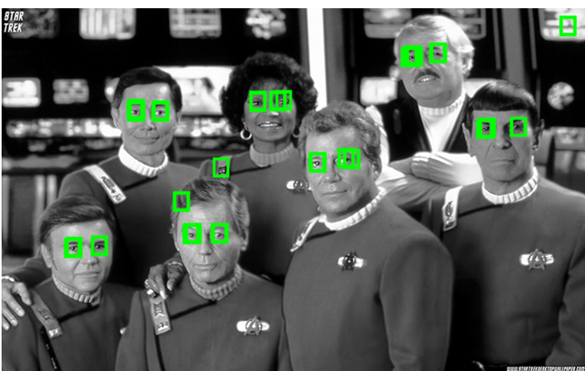

# Eye detection using multi-layered neural network

## Trained a neural network with 3 hidden layers: 16 nodes in first layer, 8 nodes in 2nd layer and 4 nodes in third one.
## Implemented gradient descent with momentum for training the network.
## Implemented L2 regularization on layer parameters.

# Results

