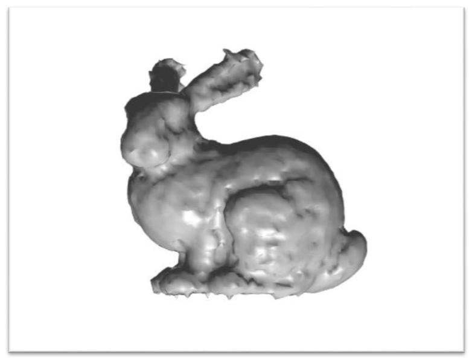

# 3D Surface reconstruction from point clouds

#### In this assignment I implemented three implicit surface reconstruction algorithms to approximate a surface represented by scattered point data. 

##### The problem can be stated as follows:
###### Given a set of points **P = {p1,p2,...,pn}** in a point cloud, we will define an implicit function f(x,y,z) that measures the signed distance to the surface approximated by these points. The surface is extracted at f(x,y,z) = 0 using the marching cubes algorithm.

#### Reconstruction Results

